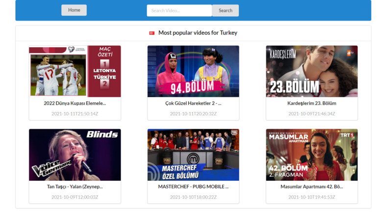
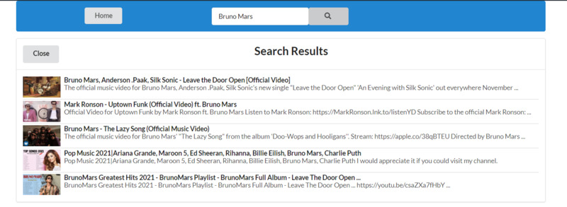
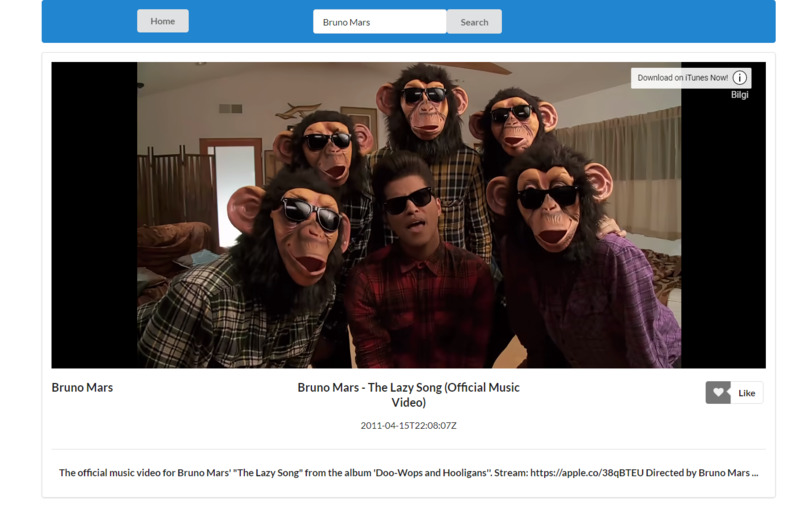
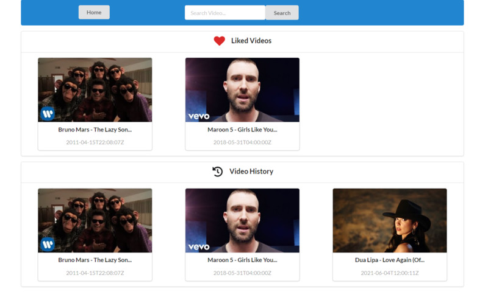

# react_yotube_api_project
## :scroll: About Project
This project is a react.js application that uses youtube features together with youtube api.When you open the project first time you will see 6 videos most popular in Turkey on home page. You can search any video, like it and unlike it. Then all of this videos that you clicked or liked appears on your home page as liked videos and video history.

## :computer: Used Technologies

|Languages & Abilities  | 
| ------------- |
| :heavy_check_mark: React.js  | 
| :heavy_check_mark: TypeScript  |
| :heavy_check_mark: JavaScript  |
| :heavy_check_mark: Semantic UI  |
| :heavy_check_mark: Axios |

## :camera: Screenshots
### 1-Home Page

### 2-Search Results

### 3-Detail Page

### 4-Liked and Last Videos

